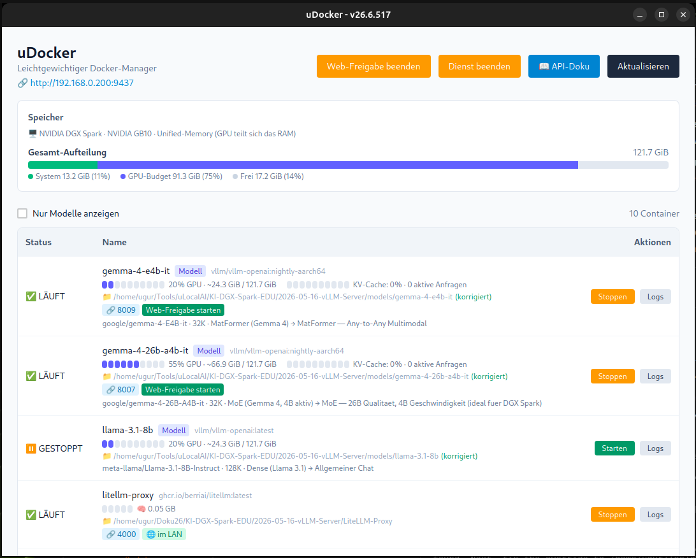
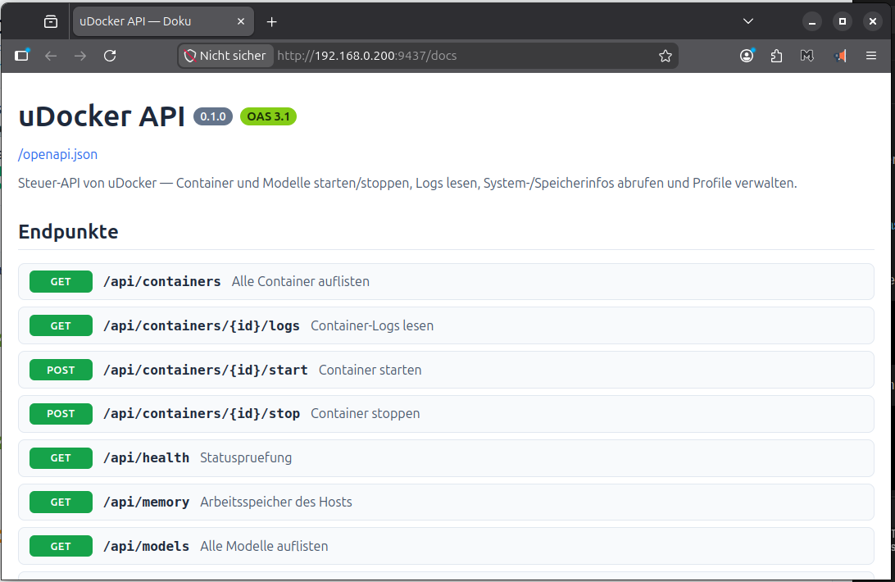

<p align="center">
  
</p>

<h1 align="center">uDocker</h1>

<p align="center">
  Ihre Docker-Container und KI-Modelle bequem verwalten — mit einem Klick, ohne Terminal.
</p>

<p align="center">
  
  
  
</p>

<p align="center">
  
</p>

---

## Warum uDocker?

Moderne KI-Modelle brauchen sehr viel Arbeits- und Grafikspeicher. Selbst auf einem leistungsstarken KI-Rechner ist dieser Speicher **begrenzt und kostbar** — man kann eben **nicht alle Modelle gleichzeitig** laufen lassen.

uDocker löst genau dieses Problem: Sie starten nur die Modelle, die Sie **gerade brauchen**, und stoppen die übrigen, um Speicher freizugeben. Danach kehren Sie mit einem Klick wieder zu Ihrer gewohnten Aufstellung zurück.

Der Schlüssel dazu sind **Profile**: Für jede Aufgabe oder Situation stellen Sie sich eine passende Gruppe von Modellen zusammen, speichern sie als Profil und wechseln jederzeit zwischen ihnen. So nutzen Sie den wertvollen Speicher Ihres Rechners optimal aus — ohne ständiges manuelles Auf- und Zumachen.

Und das Beste: Diese Start- und Stopp-Vorgänge lassen sich auch **automatisch** auslösen — über die eingebaute Schnittstelle (API) von uDocker. Damit können KI-Assistenten und Chatbots (zum Beispiel **Claude Code**) selbst die Modelle starten, die sie im Moment benötigen, und nicht mehr gebrauchte wieder schließen. Ihr Rechner stellt so immer genau die richtige KI-Leistung bereit — automatisch und speichersparend.

---

## Was macht dieses Programm?

uDocker zeigt Ihnen alle Ihre Container auf einen Blick und lässt Sie sie **mit einem Klick starten, stoppen und überwachen** — ganz ohne Befehle im Terminal.

- Container starten und stoppen, Protokolle ansehen — alles per Mausklick.
- Sehen Sie sofort, **wie viel Arbeitsspeicher und Grafikspeicher** gerade verbraucht wird.
- Besonders praktisch für **lokale KI-Modelle**: Sie sehen die Auslastung und wechseln Modelle bequem.
- Steuern Sie alles auch **vom Handy oder einem anderen Gerät** im selben Netzwerk — direkt im Browser.

---

## Ihre Vorteile

<table>
<tr>
<td width="80" align="center"><h1>📦</h1></td>
<td>
<strong>Alles mit einem Klick</strong><br>
Container starten, stoppen und Protokolle ansehen — ohne ein einziges Kommando zu tippen. Sie sehen sofort, was läuft und was gestoppt ist.
</td>
</tr>
<tr>
<td width="80" align="center"><h1>🧠</h1></td>
<td>
<strong>KI-Modelle im Griff</strong><br>
Speziell für lokale Sprachmodelle gemacht: Sie sehen die Grafikspeicher-Auslastung, die aktive Last und können Modelle bequem starten oder wechseln.
</td>
</tr>
<tr>
<td width="80" align="center"><h1>📊</h1></td>
<td>
<strong>Speicher immer im Blick</strong><br>
Übersichtliche Balken zeigen Ihnen, wie viel Arbeitsspeicher und Grafikspeicher belegt ist — so wissen Sie jederzeit, wie viel Luft noch bleibt.
</td>
</tr>
<tr>
<td width="80" align="center"><h1>💾</h1></td>
<td>
<strong>Profile speichern und laden</strong><br>
Stellen Sie eine Gruppe von Containern zusammen, speichern Sie sie als Profil und stellen Sie sie später mit einem Klick wieder her. Ideal, um zwischen Arbeitsumgebungen zu wechseln.
</td>
</tr>
<tr>
<td width="80" align="center"><h1>📱</h1></td>
<td>
<strong>Auch vom Handy steuern</strong><br>
Geben Sie die Oberfläche im Netzwerk frei und steuern Sie Ihre Container vom Handy, Tablet oder einem anderen Computer — einfach im Browser, ganz ohne zusätzliche App.
</td>
</tr>
<tr>
<td width="80" align="center"><h1>🌐</h1></td>
<td>
<strong>Dienste freigeben</strong><br>
Machen Sie einen laufenden Dienst mit einem Klick für andere Geräte im Netzwerk erreichbar — praktisch, wenn Kollegen oder Ihr Handy darauf zugreifen sollen.
</td>
</tr>
<tr>
<td width="80" align="center"><h1>🪶</h1></td>
<td>
<strong>Leicht und schnell</strong><br>
Eine schlanke, native Anwendung — kein schwergewichtiges Programm im Hintergrund. Startet schnell und verbraucht kaum Ressourcen.
</td>
</tr>
<tr>
<td width="80" align="center"><h1>🔒</h1></td>
<td>
<strong>Bleibt bei Ihnen</strong><br>
uDocker verwaltet Ihr eigenes Docker direkt auf Ihrem Rechner. Keine Cloud, kein Konto, keine Daten an Dritte.
</td>
</tr>
<tr>
<td width="80" align="center"><h1>📖</h1></td>
<td>
<strong>Eingebaute Bedienungs-Doku</strong><br>
uDocker bringt eine übersichtliche Seite mit, die alle Steuer-Befehle auflistet — anklickbar und immer aktuell, falls Sie uDocker einmal automatisiert ansprechen möchten.
</td>
</tr>
</table>

### uDocker im Vergleich

| | uDocker | Übliche Docker-Oberflächen |
|--|---------|----------------------------|
| Preis | **Kostenlos nutzbar** | Teils kostenpflichtig |
| Ressourcenbedarf | **Sehr gering (native App)** | Oft hoch |
| KI-Modelle (Grafikspeicher) | **Eingebaut, mit Anzeige** | Meist nicht vorhanden |
| Profile (Container-Gruppen) | **Ja, mit einem Klick** | Selten |
| Vom Handy steuerbar | **Ja, im Browser** | Teilweise |
| Im Hintergrund + Symbolleiste | **Ja** | Teilweise |

---

## So sieht es aus

<p align="center">
  <br>
  <em>Hauptansicht: Container und Modelle mit Speicheraufteilung, Auslastung und Steuerung per Klick</em>
</p>

<p align="center">
  <br>
  <em>Eingebaute Übersicht der Steuer-Befehle — damit Assistenten wie Claude Code Modelle automatisch öffnen und schließen können</em>
</p>

---

## Alle Infos zu jedem Modell auf einen Blick

Für jedes KI-Modell zeigt uDocker auf einen Blick, was es gerade tut und wie viel es verbraucht — ohne dass Sie etwas nachschlagen müssen:

- **Auslastung** — wie viel Grafikleistung und Speicher das Modell belegt (z. B. *55 % GPU · ~66,9 GiB / 121,7 GiB*).
- **Live-Last** — wie stark das Modell aktuell beansprucht wird (KV-Cache-Füllung und Anzahl der laufenden Anfragen).
- **Speicherort** — der Ordner des Modells, direkt anklickbar; fehlt der Ordner, wird das farblich hervorgehoben.
- **Adresse & Freigabe** — der Port des Modells und ein Klick, um es im Netzwerk freizugeben.
- **Modell-Steckbrief** — Herkunft, Kontextgröße und Bauart in Klartext, z. B.:

  > *google/gemma-4-26B-A4B-it · 32K · MoE (Gemma 4, 4B aktiv) → 26B-Qualität bei 4B-Geschwindigkeit (ideal für DGX Spark)*

So sehen Sie sofort, welches Modell sich für welche Aufgabe lohnt — und welches gerade Speicher belegt, den Sie vielleicht freigeben möchten.

---

## Installation

### Voraussetzung

- **Docker** muss auf Ihrem Rechner installiert sein — [Docker Desktop](https://www.docker.com/products/docker-desktop/) (Windows/macOS) oder Docker Engine (Linux).

### Fertige Version herunterladen

Laden Sie die passende Datei von der [Releases-Seite](https://github.com/ugurat/uDocker/releases) herunter:

**Linux (Ubuntu / Debian):**
- `.deb` per Doppelklick installieren — oder im Terminal:
  ```bash
  sudo dpkg -i uDocker_*.deb
  ```
- Alternativ die `.AppImage` herunterladen, ausführbar machen und direkt starten:
  ```bash
  chmod +x uDocker_*.AppImage
  ./uDocker_*.AppImage
  ```

**Linux (Fedora / openSUSE):**
- `.rpm` herunterladen und installieren.

**macOS:**
- `.dmg` öffnen und uDocker in den Programme-Ordner ziehen.

---

## Benutzung

1. **Docker starten** (Docker Desktop bzw. den Docker-Dienst).
2. **uDocker öffnen** — alle Container erscheinen automatisch in der Liste.
3. Container mit den Schaltflächen **Starten** / **Stoppen** steuern, **Logs** zum Ansehen der Protokolle.
4. Den **Speicher-Balken** im Blick behalten, um die Auslastung zu sehen.
5. Optional: einen Zustand als **Profil speichern** und später mit einem Klick wiederherstellen.

### Vom Handy oder einem anderen Gerät zugreifen

1. In uDocker auf **„Web-Freigabe starten"** klicken.
2. Die angezeigte Adresse (z. B. `http://192.168.0.x`) am Handy oder einem anderen Computer im **selben Netzwerk** im Browser öffnen.
3. Sie sehen dieselbe Oberfläche und können Ihre Container von überall im Heim- oder Büronetz steuern.

---

## Lizenz

uDocker ist **kostenlose Freeware** — jeder darf das Programm herunterladen,
installieren und nutzen. Die originalen, unveränderten Installationspakete dürfen
unentgeltlich weitergegeben werden.

Der Quellcode ist **nicht** öffentlich. Alle Rechte vorbehalten.

Copyright © 2026 **Ugur Cigdem**. Einzelheiten in der Datei [LICENSE](LICENSE).

---

<p align="center">
  <sub>Erstellt von <a href="https://github.com/UgurCigdem/">Ugur Cigdem</a></sub>
</p>
